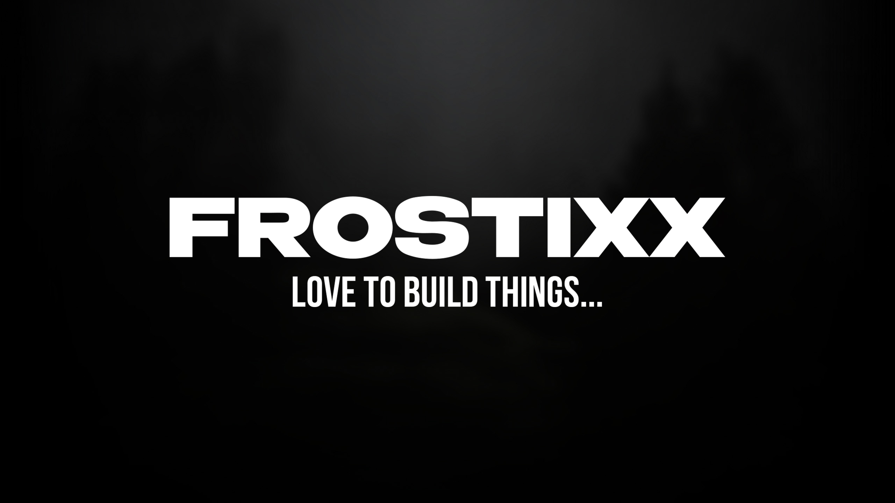

  

<h1>FROSTIXX</h1>

  <strong>CREATOR · BUILDER · EXPERIMENTER</strong>

  I have an idea. 
  I build it. That's pretty much it.

 

---

<h2>✦ ABOUT</h2>

  I'm <strong>Frostixx</strong>.

  I like creating things of all kinds — small tools, experiments,
  mods, websites, game projects and whatever else I find interesting.

  I don't really stick to one direction. 
  <strong>If something seems interesting, I want to build it.</strong>

---

<h2>✦ WHAT I'M DOING</h2>

  🐍 Learning Python 
  🤖 Building with AI-assisted development 
  💡 Turning ideas into real projects 
  🧪 Experimenting with different technologies 
  🎮 Making things around games and the things I enjoy

---

<h2>✦ PROJECTS</h2>

  I build a lot of different things.

  Some projects start as a small idea. 
  Some are experiments. 
  Some become useful tools. 
  Some grow into something much bigger.

  There isn't really one specific category.

  <strong>If I have an idea, I try to build it.</strong>

 

<a href="https://github.com/frostixx-official?tab=repositories">
  <strong>VIEW ALL PROJECTS →</strong>
</a>

 

---

<h2>✦ FIND ME</h2>

  <strong>Discord</strong> ·
  <a href="https://discord.com/users/1356324367025443028">Frostixx</a>

  <strong>YouTube</strong> ·
  <a href="https://www.youtube.com/@frostixx_official">@frostixx_official</a>

  <strong>Modrinth</strong> ·
  <a href="https://modrinth.com/user/Frostixx">Frostixx</a>

 

---

 

<h3>BUILD THINGS YOU WANT TO SEE EXIST.</h3>

 

Frostixx · 2026

